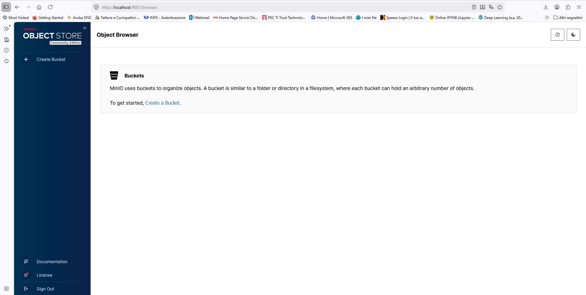
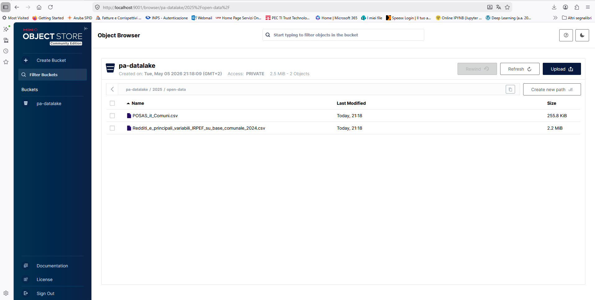
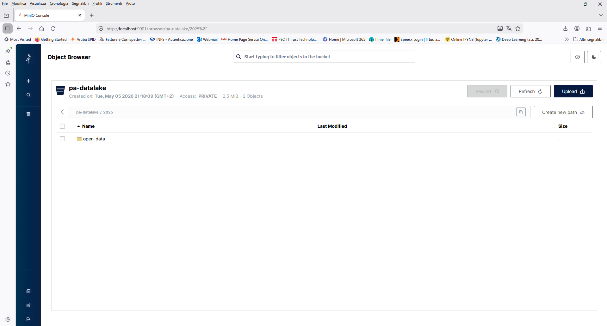
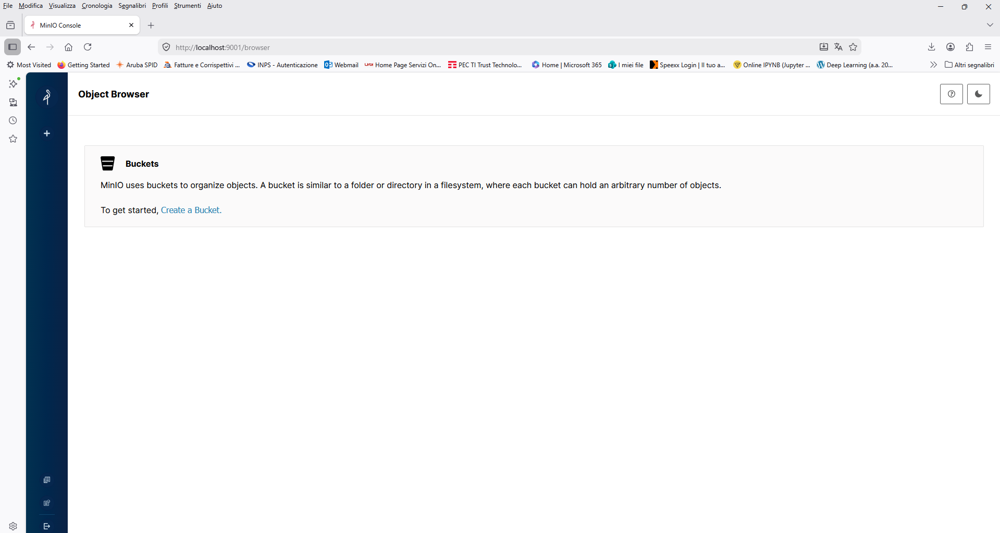
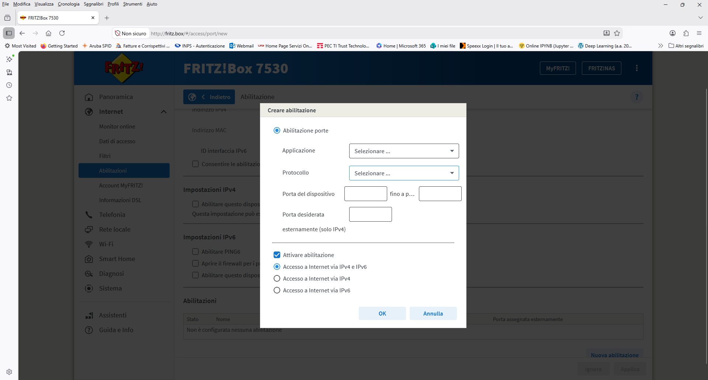
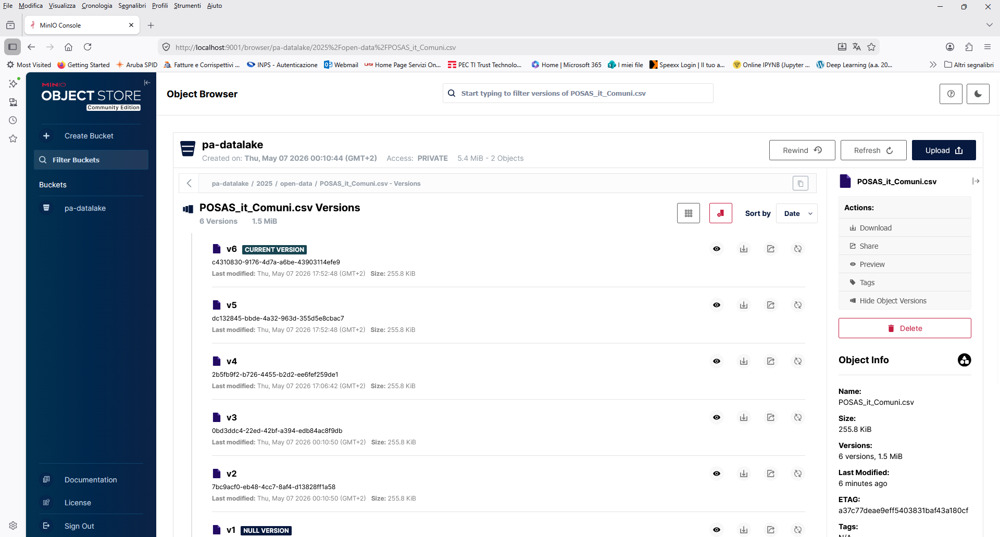

# D2 — Mini data-lake con MinIO

**Autore:** Alessandro Bianco  
**Codice variante:** D2  
**Repo:** https://github.com/abianco-79/nv-progettino-D2-bianco

---

## 1. Obiettivo

Il progettino costruisce un mini "data lake" locale basato su MinIO, un object storage S3-compatible eseguito in Docker. Lo scopo è capire la differenza tra storage a oggetti e storage tradizionale a file, imparare a interagire con l'API S3 tramite Python (boto3), e simulare in locale un'infrastruttura cloud-native tipica di contesti PA che gestiscono open data. I dataset usati sono reali: dati ISTAT sulla popolazione comunale (POSAS) e dati MEF sui redditi IRPEF per comune (2024).

---

## 2. Architettura

```
┌─────────────────────────────────────────────────────┐
│                  Docker Compose                     │
│                                                     │
│  ┌─────────────────────┐   ┌──────────────────────┐ │
│  │       minio         │   │       client         │ │
│  │  minio/minio:latest │   │   python:3.11-slim   │ │
│  │                     │   │                      │ │
│  │  :9000 → API S3     │◄──│  boto3 + pandas      │ │
│  │  :9001 → Console    │   │  upload.py           │ │
│  └─────────┬───────────┘   └──────────────────────┘ │
│            │ volume                                 │
│     minio-data (nominato)                           │
└─────────────────────────────────────────────────────┘
         │                │
    localhost:9000    localhost:9001
      (API S3)        (Console web)
```

Il container `minio` espone l'API S3 sulla porta 9000 e la console web sulla porta 9001. Il container `client` si connette a MinIO tramite la rete interna Docker (`http://minio:9000`), crea il bucket `pa-datalake`, carica i dataset e ne esegue l'analisi. I dati persistono nel volume nominato `minio-data`.

---

## 3. Prerequisiti

- Windows 11 con WSL2 (Ubuntu 24.04)
- Docker Desktop 4.x con integrazione WSL2 attiva
- Git
- Python 3.11+ (solo per sviluppo locale; non serve per la demo)

---

## 4. Come riprodurre passo-passo

**4.1 Clonazione del repo e creazione della struttura**

```bash
git clone https://github.com/abianco-79/nv-progettino-D2-bianco.git
cd nv-progettino-D2-bianco

mkdir -p src scripts screenshots data
touch compose.yaml .env .gitignore README.md
touch src/upload.py
touch scripts/setup.sh scripts/teardown.sh
```

**4.2 Creazione del file `.env`**

Crea manualmente un file `.env` nella root del progetto con questo contenuto:

```
MINIO_ROOT_USER=minioadmin
MINIO_ROOT_PASSWORD=minioadmin123
```

Il file `.env` è in `.gitignore` e non viene committato.

**4.3 Creazione del file `compose.yalm`**

```yaml
cat > compose.yaml << 'EOF'
services:
  minio:
    image: minio/minio:latest
    container_name: minio
    command: server /data --console-address ":9001"
    ports:
      - "9000:9000"
      - "9001:9001"
    volumes:
      - minio-data:/data
    env_file:
      - .env
    healthcheck:
      test: ["CMD", "curl", "-f", "http://localhost:9000/minio/health/live"]
      interval: 10s
      timeout: 5s
      retries: 5

  client:
    build: .
    container_name: minio-client
    depends_on:
      minio:
        condition: service_healthy
    env_file:
      - .env
    volumes:
      - ./src:/app/src
      - ./data:/app/data

volumes:
  minio-data:
EOF
```

Questo comando sta creando "da zero" il file di configurazione per l'intero ambiente di lavoro. Nello specifico, usa un comando shell (`cat`) per scrivere il contenuto tra `EOF` dentro un file chiamato `compose.yaml`.

Il file definisce **due servizi** che lavorano insieme: uno è il server dove vengono salvati i file (MinIO) e l'altro è il programma che li carica (il client).

------

##### Service `minio` (Il Server)

È il cuore del sistema, un sistema di storage compatibile con Amazon S3.

- **`image: minio/minio:latest`**: Scarica l'ultima versione ufficiale di MinIO.
- **`command: server /data --console-address ":9001"`**: Avvia il server dicendogli di salvare i dati nella cartella `/data` e di rendere disponibile l'interfaccia web sulla porta `9001`.
- **`ports`**: Apre le "porte" del container verso il tuo computer:
  - `9000`: Per le operazioni tecniche (API).
  - `9001`: Per vedere la console grafica nel browser.
- **`volumes`**: Crea uno spazio persistente chiamato `minio-data`. Anche se si distrugge il container, i file salvati qui rimarranno al sicuro.
- **`healthcheck`**: Il container controlla da solo se "sta bene" provando a contattare il proprio servizio ogni 10 secondi. Se non risponde, viene considerato "unhealthy".

------

##### Service `client` (lo script)

È il contenitore che farà girare il codice Python.

- **`build: .`**: Non scarica un'immagine pronta, ma la crea partendo dai file presenti nella cartella (cerca un file chiamato `Dockerfile`).
- **`depends_on`**: Questo evita che lo script fallisca perché il server non ha ancora finito di accendersi (ovvero il client non si avvierà finche il servizio MinIo non è healthy).
- **`env_file: - .env`**: Legge le credenziali (come username e password) da un file esterno chiamato `.env`, così da non indicarle in chiaro nel codice.
- **`volumes`**: Collega le cartelle locali (`./src` e `./data`) all'interno del container. Se si modifica un file sul PC, la modifica appare istantaneamente anche dentro il container.

------

##### I Volumi

```yaml
volumes:
  minio-data:
```

Questa sezione dichiara ufficialmente il volume per MinIO

**4.4 Avvio di MinIO**

```bash
docker compose up -d minio
docker compose ps
```

Output restituito:

```
[+] up 2/2
 ✔ Container minio-client Started                                                                      11.5s
 ✔ Container minio        Healthy
 
NAME      IMAGE                COMMAND                  SERVICE   CREATED        STATUS                    PORTS
minio     minio/minio:latest   "/usr/bin/docker-ent…"   minio     25 hours ago   Up 55 seconds (healthy)   0.0.0.0:9000-9001->9000-9001/tcp, [::]:9000-9001->9000-9001/tcp
```

**4.5 Apertura della console MinIO**

Apertura sul browser di `http://localhost:9001` e login con le credenziali del `.env`. La console mostra inizialmente nessun bucket.



**4.6 Creazione del file ** **`dockerfile`**

```bash
cat > Dockerfile << 'EOF'
FROM python:3.11-slim

WORKDIR /app

RUN pip install boto3 pandas

COPY src/ ./src/
COPY data/ ./data/

CMD ["python", "src/upload.py"]
EOF
```

1. Parte da un'immagine Python 3.11 leggera
2. Installa `boto3` (per parlare con MinIO via API S3) e `pandas` (per l'analisi CSV)
3. Copia il codice e i dataset nel container
4. Quando parte, esegue lo script Python

**4.7 Creazione del file ** **`upload.py`**

```python
cat > src/upload.py << 'EOF'
import boto3
import pandas as pd
import os
from botocore.exceptions import ClientError

# ── Configurazione connessione ──────────────────────────────────────────────
ENDPOINT   = "http://minio:9000"
ACCESS_KEY = os.environ["MINIO_ROOT_USER"]
SECRET_KEY = os.environ["MINIO_ROOT_PASSWORD"]
BUCKET     = "pa-datalake"

DATASETS = [
    "data/POSAS_it_Comuni.csv",
    "data/Redditi_e_principali_variabili_IRPEF_su_base_comunale_2024.csv",
]

# ── Client S3 ───────────────────────────────────────────────────────────────
s3 = boto3.client(
    "s3",
    endpoint_url=ENDPOINT,
    aws_access_key_id=ACCESS_KEY,
    aws_secret_access_key=SECRET_KEY,
)

# ── 1. Crea bucket (se non esiste) ──────────────────────────────────────────
def crea_bucket():
    try:
        s3.head_bucket(Bucket=BUCKET)
        print(f"[OK] Bucket '{BUCKET}' esiste già")
    except ClientError:
        s3.create_bucket(Bucket=BUCKET)
        print(f"[OK] Bucket '{BUCKET}' creato")

# ── 2. Upload dei dataset ───────────────────────────────────────────────────
def upload_datasets():
    for path in DATASETS:
        key = "2025/open-data/" + os.path.basename(path)
        with open(path, "rb") as f:
            risposta = s3.put_object(Bucket=BUCKET, Key=key, Body=f)
        status = risposta["ResponseMetadata"]["HTTPStatusCode"]
        print(f"[UPLOAD] {path} → s3://{BUCKET}/{key}  [HTTP {status}]")

# ── 3. Lista oggetti con metadati ───────────────────────────────────────────
def lista_oggetti():
    print("\n── Oggetti nel bucket ──────────────────────────────────────────")
    risposta = s3.list_objects_v2(Bucket=BUCKET)
    for obj in risposta.get("Contents", []):
        size_kb = obj["Size"] / 1024
        head = s3.head_object(Bucket=BUCKET, Key=obj["Key"])
        print(f"  KEY:           {obj['Key']}")
        print(f"  size:          {size_kb:.1f} KB")
        print(f"  last-modified: {obj['LastModified']}")
        print(f"  content-type:  {head['ContentType']}")
        print(f"  etag:          {head['ETag']}")
        print()

# ── 4. Download, testata e analisi ──────────────────────────────────────────
def analisi():
    print("\n── Dataset 1: POSAS_it_Comuni.csv ──────────────────────────────")
    key1   = "2025/open-data/POSAS_it_Comuni.csv"
    local1 = "/tmp/comuni_download.csv"
    s3.download_file(BUCKET, key1, local1)
    print(f"[DOWNLOAD] s3://{BUCKET}/{key1} → {local1}")

    df1 = pd.read_csv(local1, sep=";", encoding="utf-8-sig")
    print(f"\nColonne: {list(df1.columns)}")
    print(f"Righe:   {len(df1)}")

    print("\n── Testata (prime 5 righe) ─────────────────────────────────────")
    print(df1.head().to_string(index=False))

    print("\n── describe() ──────────────────────────────────────────────────")
    print(df1.describe())

    print("\n── Top 5 comuni per popolazione ────────────────────────────────")
    top5 = df1.nlargest(5, "Totale")[["Comune", "Totale maschi", "Totale femmine", "Totale"]]
    print(top5.to_string(index=False))

    print("\n── Dataset 2: Redditi_IRPEF_su_base_comunale_2024.csv ──────────")
    key2   = "2025/open-data/Redditi_e_principali_variabili_IRPEF_su_base_comunale_2024.csv"
    local2 = "/tmp/irpef_download.csv"
    s3.download_file(BUCKET, key2, local2)
    print(f"[DOWNLOAD] s3://{BUCKET}/{key2} → {local2}")

    df2 = pd.read_csv(local2, sep=";", encoding="utf-8-sig")
    print(f"\nColonne totali: {len(df2.columns)}")
    print(f"Righe:          {len(df2)}")

    print("\n── Testata (prime 3 righe, prime 6 colonne) ────────────────────")
    print(df2.iloc[:3, :6].to_string(index=False))

    col_reddito = "Reddito complessivo - Ammontare in euro"
    col_comune  = "Denominazione Comune"
    col_contrib = "Numero contribuenti"
    print("\n── Top 5 comuni per reddito complessivo ────────────────────────")
    top5_irpef = df2.nlargest(5, col_reddito)[[col_comune, col_contrib, col_reddito]]
    print(top5_irpef.to_string(index=False))

# ── Main ────────────────────────────────────────────────────────────────────
if __name__ == "__main__":
    print("═══════════════════════════════════════════════════════════════")
    print("  MinIO PA Data Lake — upload & analisi")
    print("═══════════════════════════════════════════════════════════════\n")
    crea_bucket()
    upload_datasets()
    lista_oggetti()
    analisi()
    print("\n[DONE] Script completato con successo.")
EOF
```

**4.8 Creazione degli script per `setup.sh` e `teardown.sh`**

File **`setup.sh`**: script per avviare l'esperimento

```bash
cat > scripts/setup.sh << 'EOF'
#!/bin/bash
set -e

echo "═══════════════════════════════════════════════════════════════"
echo "  MinIO PA Data Lake — avvio"
echo "═══════════════════════════════════════════════════════════════"

# Avvia MinIO in background
echo "[1/3] Avvio container MinIO..."
docker compose up -d minio

# Aspetta che MinIO sia healthy
echo "[2/3] Attendo che MinIO sia pronto..."
until docker compose exec minio curl -sf http://localhost:9000/minio/health/live; do
    echo "  ... ancora in attesa"
    sleep 2
done
echo "  MinIO è pronto!"

# Esegui lo script Python
echo "[3/3] Eseguo upload e analisi..."
docker compose run --rm client python src/upload.py

echo ""
echo "✓ Setup completato!"
echo "  Console MinIO: http://localhost:9001"
echo "  Credenziali:   vedi .env"
EOF
```

File **`teardown.sh`**: script per pulire al termine

```bash
cat > scripts/teardown.sh << 'EOF'
#!/bin/bash

echo "═══════════════════════════════════════════════════════════════"
echo "  MinIO PA Data Lake — teardown"
echo "═══════════════════════════════════════════════════════════════"

echo "Scegli modalità:"
echo "  1) Soft — ferma i container ma mantieni i dati (volume intatto)"
echo "  2) Hard — ferma i container E distruggi il volume (dati persi)"
read -p "Scelta [1/2]: " scelta

if [ "$scelta" = "2" ]; then
    echo "[HARD] docker compose down -v ..."
    docker compose down -v
    echo "✓ Container e volume rimossi."
else
    echo "[SOFT] docker compose down ..."
    docker compose down
    echo "✓ Container fermati. Il volume minio-data è intatto."
fi
EOF
```

Dopo la loro creazione, vanno resi eseguibili con il comando:

```bash
chmod +x scripts/setup.sh scripts/teardown.sh
```

**4.9 Copia dei dataset all'interno della cartella /data**

```bash
cp /mnt/c/Users/aless/Downloads/POSAS_it_Comuni.csv ~/nv-progettino-D2-bianco/data/
cp "/mnt/c/Users/aless/Downloads/Redditi_e_principali_variabili_IRPEF_su_base_comunale_2024.csv" ~/nv-progettino-D2-bianco/data/
```

**4.10 Esecuzione dello script di upload e analisi**

```bash
docker compose run --rm client python src/upload.py
```

Lo script esegue in sequenza:

1. Crea il bucket `pa-datalake` (se non esiste)
2. Carica i due dataset CSV con prefisso `2025/open-data/`
3. Lista gli oggetti con metadati: size, last-modified, content-type, etag
4. Scarica i file, mostra la testata e produce statistiche con pandas

Per i risultati dello script, si rimanda alla sezione **5.2 Output script di upload**.

**4.11 Verifica sulla console**

Tornando su `http://localhost:9001` → Buckets → `pa-datalake` → `2025/open-data/` → i due CSV sono visibili.




---

## 5. Verifica del funzionamento

**5.1 Stato dei container**

```bash
docker compose ps
```

**5.2 Output script di upload**

```
abianco@DESKTOP-0UIHB5R:~/nv-progettino-D2-bianco/src$ docker compose run --rm client python src/upload.py
[+]  1/1t 1/1
 ✔ Container minio Started                                                                                                                                                              0.5s
Container minio Waiting
Container minio Healthy
Container nv-progettino-d2-bianco-client-run-67b48095c9ea Creating
Container nv-progettino-d2-bianco-client-run-67b48095c9ea Created
═══════════════════════════════════════════════════════════════
  MinIO PA Data Lake — upload & analisi
═══════════════════════════════════════════════════════════════

[OK] Bucket 'pa-datalake' esiste già
[UPLOAD] data/POSAS_it_Comuni.csv → s3://pa-datalake/2025/open-data/POSAS_it_Comuni.csv  [HTTP 200]
[UPLOAD] data/Redditi_e_principali_variabili_IRPEF_su_base_comunale_2024.csv → s3://pa-datalake/2025/open-data/Redditi_e_principali_variabili_IRPEF_su_base_comunale_2024.csv  [HTTP 200]

── Oggetti nel bucket ──────────────────────────────────────────
  KEY:           2025/open-data/POSAS_it_Comuni.csv
  size:          255.8 KB
  last-modified: 2026-05-07 15:06:42.234000+00:00
  content-type:  binary/octet-stream
  etag:          "a37c77deae9eff5403831baf43a180cf"

  KEY:           2025/open-data/Redditi_e_principali_variabili_IRPEF_su_base_comunale_2024.csv
  size:          2259.2 KB
  last-modified: 2026-05-07 15:06:42.289000+00:00
  content-type:  binary/octet-stream
  etag:          "177ed1357ff84d7949601b003ac25e0a"


── Dataset 1: POSAS_it_Comuni.csv ──────────────────────────────
[DOWNLOAD] s3://pa-datalake/2025/open-data/POSAS_it_Comuni.csv → /tmp/comuni_download.csv

Colonne: ['Codice comune', 'Comune', 'Totale maschi', 'Totale femmine', 'Totale']
Righe:   7896

── Testata (prime 5 righe) ─────────────────────────────────────
 Codice comune                Comune  Totale maschi  Totale femmine  Totale
         28001           Abano Terme           9805           10674   20479
         98001       Abbadia Cerreto            139             141     280
         97001       Abbadia Lariana           1537            1601    3138
         52001 Abbadia San Salvatore           3111            3006    6117
         95001             Abbasanta           1244            1295    2539

── describe() ──────────────────────────────────────────────────
       Codice comune  Totale maschi  Totale femmine        Totale
count    7896.000000   7.896000e+03    7.896000e+03  7.896000e+03
mean    45241.979863   3.662694e+03    3.802203e+03  7.464897e+03
std     32641.735438   1.992505e+04    2.158940e+04  4.151195e+04
min      1001.000000   1.800000e+01    1.200000e+01  3.000000e+01
25%     16147.750000   4.850000e+02    4.780000e+02  9.647500e+02
50%     40043.500000   1.184000e+03    1.191000e+03  2.379500e+03
75%     73007.250000   3.093750e+03    3.132250e+03  6.250250e+03
max    111107.000000   1.307339e+06    1.437723e+06  2.745062e+06

── Top 5 comuni per popolazione ────────────────────────────────
 Comune  Totale maschi  Totale femmine  Totale
   Roma        1307339         1437723 2745062
 Milano         663800          699063 1362863
 Napoli         436314          468736  905050
 Torino         414118          441536  855654
Palermo         299720          326553  626273

── Dataset 2: Redditi_IRPEF_su_base_comunale_2024.csv ──────────
[DOWNLOAD] s3://pa-datalake/2025/open-data/Redditi_e_principali_variabili_IRPEF_su_base_comunale_2024.csv → /tmp/irpef_download.csv

Colonne totali: 53
Righe:          7897

── Testata (prime 3 righe, prime 6 colonne) ────────────────────
 Anno di imposta Codice catastale  Codice Istat Comune Denominazione Comune Sigla Provincia   Regione
            2024             A001                28001          ABANO TERME              PD    Veneto
            2024             A004                98001      ABBADIA CERRETO              LO Lombardia
            2024             A005                97001      ABBADIA LARIANA              LC Lombardia

── Top 5 comuni per reddito complessivo ────────────────────────
Denominazione Comune  Numero contribuenti  Reddito complessivo - Ammontare in euro
                ROMA              1994045                              62659555874
              MILANO              1052520                              42433764683
              TORINO               643012                              18708066883
              GENOVA               469207                              12758727040
              NAPOLI               511662                              12478273911

[DONE] Script completato con successo.
```

**5.3 Verifica persistenza — soft restart**

```bash
docker compose down
docker compose up -d minio
```

Output:

```
abianco@DESKTOP-0UIHB5R:~/nv-progettino-D2-bianco$ docker compose down
[+] down 3/3
 ✔ Container minio-client                  Removed                                                      0.1s
 ✔ Container minio                         Removed                                                      0.5s
 ✔ Network nv-progettino-d2-bianco_default Removed  

abianco@DESKTOP-0UIHB5R:~/nv-progettino-D2-bianco$ docker compose up -d minio
[+] up 2/2
 ✔ Network nv-progettino-d2-bianco_default Created                                                      0.1s
 ✔ Container minio                         Started    
```

Aprendo `http://localhost:9001` → il bucket e i file sono ancora presenti.



**5.4 Verifica distruttiva — hard reset**

```bash
docker compose down -v
docker compose up -d minio
```

Output:

```
abianco@DESKTOP-0UIHB5R:~/nv-progettino-D2-bianco$ docker compose down -v
[+] down 3/3
 ✔ Container minio                           Removed                                                    0.5s
 ✔ Volume nv-progettino-d2-bianco_minio-data Removed                                                    0.0s
 ✔ Network nv-progettino-d2-bianco_default   Removed    
 
 [+] up 3/3
 ✔ Network nv-progettino-d2-bianco_default   Created                                                    0.1s
 ✔ Volume nv-progettino-d2-bianco_minio-data Created                                                    0.0s
 ✔ Container minio                           Started   
```

Apremdo`http://localhost:9001` → il bucket è sparito.



**5.5 Inspect del volume**

```bash
docker volume inspect nv-progettino-d2-bianco_minio-data
```

Output:

```
abianco@DESKTOP-0UIHB5R:~/nv-progettino-D2-bianco$ docker volume inspect nv-progettino-d2-bianco_minio-data
[
    {
        "CreatedAt": "2026-05-06T23:46:39+02:00",
        "Driver": "local",
        "Labels": {
            "com.docker.compose.config-hash": "77879c98d1f6a653e0f3fbc68ccf92aa7d533f88192ba9dc2404e2359afd5c2c",
            "com.docker.compose.project": "nv-progettino-d2-bianco",
            "com.docker.compose.version": "5.1.3",
            "com.docker.compose.volume": "minio-data"
        },
        "Mountpoint": "/var/lib/docker/volumes/nv-progettino-d2-bianco_minio-data/_data",
        "Name": "nv-progettino-d2-bianco_minio-data",
        "Options": null,
        "Scope": "local"
    }
]
```

Una volta definito `minio-data` nel file Compose, Docker ha creato questo **Volume** per assicurarsi che i file caricati su MinIO non spariscano ogni volta che si spenga il container.

##### Il "Mountpoint" (Dove si trovano i dati?)

La riga più importante è questa: `"Mountpoint": "/var/lib/docker/volumes/nv-progettino-d2-bianco_minio-data/_data"`

Questo è il percorso **reale** all'interno del motore Docker dove sono salvati fisicamente i file di MinIO. Quando si carica un'immagine sulla console, Docker la scrive in quella cartella.

##### Il Nome del Volume

Il nome è diventato `nv-progettino-d2-bianco_minio-data`. Docker Compose aggiunge sempre il **nome della cartella del progetto** (il prefisso) al nome scelto nel file YAML. Questo serve a evitare conflitti se si hanno due progetti diversi che chiamano entrambi il loro volume "minio-data".

##### Labels (Metadati)

Queste informazioni dicono a Docker che questo volume non è stato creato "a caso", ma appartiene al progetto `nv-progettino-d2-bianco` gestito da Docker Compose. È grazie a queste etichette che, quando lanci `docker compose down -v`, Docker sa esattamente quale volume deve andare a cancellare.

Questo output ci conferma che:

1. Il volume è stato **creato correttamente**.
2. È di tipo **local** (risiede sul disco fisso).
3. Indica la data di creazione (`CreatedAt`).

In pratica, è la prova che il sistema di "memoria a lungo termine" per MinIO è attivo e funzionante.

## 6. Riflessioni e punti aperti

##### 6.1. Se sostituissi MinIO con AWS S3 reale, quante righe di codice cambierebbero?

Tecnicamente **una sola riga** in ogni file che istanzia il client boto3: la rimozione del parametro `endpoint_url`. Su AWS S3 reale boto3 risolve automaticamente l'endpoint corretto in base alla region, quindi non va specificato.

Da:

```python
s3 = boto3.client(
    "s3",
    endpoint_url="http://minio:9000",   # ← questa riga sparisce
    aws_access_key_id=ACCESS_KEY,
    aws_secret_access_key=SECRET_KEY,
)
```

A:

```python
s3 = boto3.client(
    "s3",
    aws_access_key_id=ACCESS_KEY,
    aws_secret_access_key=SECRET_KEY,
    region_name="eu-south-1",           # ← si aggiunge la region AWS
)
```

Tutto il resto — `create_bucket`, `put_object`, `list_objects_v2`, `head_object`, `download_file`, il versioning, le policy — funziona identico perché MinIO implementa fedelmente l'API S3 di Amazon. Questo è esattamente il valore della compatibilità S3: il codice scritto contro MinIO in locale è già pronto per il cloud senza riscritture. L'unica altra cosa che cambierebbe è la sorgente delle credenziali: su AWS si userebbero IAM roles o variabili d'ambiente gestite da un secret manager, non credenziali root hardcoded nel `.env`.

------

##### 6.2. Cosa cambia tra archiviare file su un volume Docker e archiviarli su MinIO? Quando il primo basta?

Un **volume Docker** è essenzialmente una directory del filesystem dell'host montata dentro un container. È veloce, semplice, non richiede configurazione. Va benissimo quando un singolo servizio deve persistere i propri dati (es. un database Postgres che scrive su `/var/lib/postgresql/data`). I limiti emergono appena si esce da questo scenario: un volume non è accessibile da più container contemporaneamente in modo sicuro, non espone un'API standardizzata, non ha concetti nativi di versioning, metadati, policy di accesso o lifecycle degli oggetti.

**MinIO** aggiunge un layer di astrazione completo sopra lo storage: ogni file diventa un oggetto indirizzabile via chiave, accessibile tramite API HTTP da qualsiasi client che parli S3, con metadati arbitrari, controllo degli accessi per utente/policy, versioning opzionale e possibilità di migrare verso AWS S3 cambiando solo l'endpoint. Il prezzo è la complessità in più: un container aggiuntivo, una porta da esporre, credenziali da gestire.

**Il volume** è sufficiente quando hai un solo servizio che scrive e legge i propri dati, senza necessità di condivisione, API esterna o portabilità cloud. Un database, i file di log di un'applicazione, la cache di un servizio — tutti casi in cui un volume è la scelta giusta e MinIO sarebbe overengineering.

Si utilizza**MinIO (o S3)** quando i dati devono essere accessibili da più servizi o sistemi eterogenei, quando serve un'API standardizzata per upload/download, quando si vuole simulare in locale un'infrastruttura che in produzione andrà su cloud, o quando i dataset sono grandi e devono essere gestiti con metadati, versioning e policy differenziate per utente.

------

##### 6.3. Per un caso PA tipo "archivio di documenti scansionati con metadati", come struttureresti i bucket e le key?

La prima decisione è quanti bucket usare. Una buona regola è creare bucket per **unità organizzativa o livello di classificazione**, non per tipo di documento. Mischiare documenti pubblici e riservati nello stesso bucket complica la gestione delle policy. Una struttura ragionevole per una PA potrebbe essere:

```
documenti-pubblici/
documenti-riservati/
documenti-storici/
```

All'interno di ogni bucket, la struttura delle chiavi dovrebbe riflettere le dimensioni di ricerca più frequenti. Per un archivio di pratiche amministrative:

```
{ente}/{anno}/{tipo-documento}/{id-pratica}.pdf
```

Ad esempio:

```
comune-torino/2024/delibere/delibera-0042.pdf
comune-torino/2024/determine/determina-0317.pdf
comune-torino/2023/contratti/contratto-0089.pdf
```

Questo schema permette query per prefisso molto efficienti: `list_objects(prefix="comune-torino/2024/delibere/")` restituisce tutte le delibere del 2024 senza scansionare l'intero bucket. I prefissi simulano una gerarchia di directory ma non lo sono: sono solo parte della stringa-chiave, e S3/MinIO li gestisce in modo nativo e ottimizzato.

I **metadati** dell'oggetto (autore, numero protocollo, stato di archiviazione, classificazione) andrebbero salvati come metadata S3 sull'oggetto stesso tramite `ExtraArgs={"Metadata": {...}}` nell'upload, oppure in un database esterno (es. Postgres) che indicizza le chiavi S3 per ricerche più complesse. Il secondo approccio è più scalabile perché S3 non supporta query sui metadati: puoi solo recuperare i metadati di un oggetto che già conosci per chiave.

------

##### 6.4. Come gestiresti il versioning degli oggetti?

MinIO supporta il versioning a livello di bucket, attivabile con una singola chiamata API (`put_bucket_versioning`). Una volta attivo, ogni `put_object` sulla stessa chiave non sovrascrive il file precedente ma crea una nuova versione con un UUID univoco (`VersionId`). Le versioni precedenti restano accessibili e scaricabili specificando il `VersionId` nella chiamata.

L'opportunità sull'attivarlo o meno dipende chiaramente dal tipo di dato. Per dataset che vengono aggiornati periodicamente — come i file ISTAT o MEF usati in questo progettino, che escono in nuove edizioni ogni anno — il versioning è utile: permette di sovrascrivere la chiave mantenendo la storia, senza dover inventare schemi di naming tipo `POSAS_it_Comuni_v2.csv`. Per documenti statici che non cambiano mai (una delibera firmata, un contratto archiviato) il versioning è inutile e aggiunge solo occupazione di storage.

Un aspetto spesso trascurato è la **gestione del ciclo di vita delle versioni**: senza una policy di lifecycle, le versioni vecchie si accumulano indefinitamente. MinIO permette di configurare regole che eliminano automaticamente le versioni più vecchie di N giorni, o che mantengono solo le ultime N versioni per chiave. In un contesto PA dove i dati hanno obblighi di conservazione precisi (es. 10 anni per certi atti amministrativi), queste regole vanno progettate con attenzione prima di attivare il versioning in produzione.

**6.5 Riflessione aggiuntiva personale "bonus": e se... volessi raggiungere MinIo da un computer esterno alla mia rete, tramite accesso ad internet?**

Per potersi collegare a MinIO da un computer esterno (non sulla rete locale), spostiamo il focus dalla semplice configurazione di Docker ad una più complessa configurazione della rete con implicazioni sulla sicurezza della stessa.

Questi sono i passaggi necessari per trasformare il progetto "locale" in un progetto "accessibile ovunque":

##### a) Configurazione del file `compose.yaml`

Il file attuale è già impostato correttamente per l'esterno perché è stata usata la sintassi `"9000:9000"`. In Docker, questo significa che il servizio è in ascolto su **tutte** le interfacce di rete del PC (`0.0.0.0`).

Tuttavia, se si vuole che chi si collega da fuori veda la Console web correttamente, è necessario aggiungere una variabile d'ambiente per gestire il reindirizzamento:

YAML

```yaml
    environment:
      MINIO_BROWSER_REDIRECT_URL: "http://94.34.155.66:9001"
```

dove ` 94.34.155.66 `è l'esempio di indirizzo IP pubblico (visibile cercando su Google "il mio ip" o da terminale tramite comando `curl ifconfig.me`.

##### b) Port Forwarding (agendo sul router)

Questa è la parte "fisica". Il computer ha un indirizzo IP privato (es.`192.168.178.22`), ma il mondo esterno vede solo l'IP pubblico del router.

Pertanto è necessario:

- Entrare nelle impostazioni del tuo router.
- Cercare la sezione **Port Forwarding** (o Port Mapping).
- Creare due regole per reindirizzare il traffico dall'esterno all'IP del PC:
  - Porta esterna `9000` -> Porta interna `9000` del PC.
  - Porta esterna `9001` -> Porta interna `9001` del PC.



##### c) Identificare l'IP Pubblico

Come anticipato, Il computer esterno non userà `localhost`, ma l'IP pubblico.

- **Esempio:** `http://94.34.155.66:9001`

Bisogna precisare che la maggior parte delle connessioni domestiche ha un **IP dinamico**, che cambia ogni volta che si riavvia il router. Per ottenere un indirizzo "statico", è necessario usare un servizio di **Dynamic DNS** (come No-IP o DuckDNS) che assegna un nome tipo `mio-progetto-minio.ddns.net`.

------

##### d) Cambiamenti nello script Python (`upload.py`)

Il computer esterno che deve caricare i dati non userà più l'endpoint interno di Docker, ma quello pubblico:

Python

```
# Nel computer esterno
ENDPOINT = "http://<ip-pubblico-o-dominio>:9000"
```

------

##### e) La questione Sicurezza (Importante!)

Chiaramente aprire le porte `9000` e `9001` al mondo intero è pericoloso. Chiunque trovi l'IP potrebbe tentare di accedere ai tuoi dati. 

Pertanto è assolutamente necessario:

- Prevedere e dotarsi di **password forti**, assicurandosi che `MINIO_ROOT_PASSWORD` nel file `.env` sia molto complessa;
- Impostare correttamente il **firewall**, verificando che possa permettare il traffico in entrata su quelle porte.
- Anziché aprire le porte sul router, utilizzare una **VPN**, come ad esempio **Tailscale** o **ZeroTier**, che creano una rete privata virtuale tra il PC e quello esterno: il computer esterno vedrà il tuo PC come se fosse nella stanza accanto, senza esporre nulla su internet.

##### Riassunto della catena di collegamento

`PC Esterno` ---> `IP Pubblico (Router)` ---> `IP Privato (PC)` ---> `Porta Docker` ---> `Container MinIO`

## 7. Estensioni opzionali

#### 7.1 Estensione del progetto — Versioning del bucket

**Creazione del file ** **`upload.py`**

```python
cat > src/versioning.py << 'EOF'
import boto3
import os
from botocore.exceptions import ClientError

ENDPOINT   = "http://minio:9000"
ACCESS_KEY = os.environ["MINIO_ROOT_USER"]
SECRET_KEY = os.environ["MINIO_ROOT_PASSWORD"]
BUCKET     = "pa-datalake"

s3 = boto3.client(
    "s3",
    endpoint_url=ENDPOINT,
    aws_access_key_id=ACCESS_KEY,
    aws_secret_access_key=SECRET_KEY,
)

# ── 1. Attiva versioning sul bucket ─────────────────────────────────────────
def attiva_versioning():
    s3.put_bucket_versioning(
        Bucket=BUCKET,
        VersioningConfiguration={"Status": "Enabled"},
    )
    risposta = s3.get_bucket_versioning(Bucket=BUCKET)
    print(f"[VERSIONING] Stato: {risposta.get('Status', 'non attivo')}")

# ── 2. Carica due volte lo stesso file con status HTTP ───────────────────────
def doppio_upload():
    key = "2025/open-data/POSAS_it_Comuni.csv"

    print(f"\n[UPLOAD v1] Carico {key} prima volta...")
    with open("data/POSAS_it_Comuni.csv", "rb") as f:
        risposta = s3.put_object(
            Bucket=BUCKET, Key=key, Body=f,
            Metadata={"versione": "v1", "nota": "caricamento iniziale"}
        )
    status = risposta["ResponseMetadata"]["HTTPStatusCode"]
    print(f"  → VersionId: {risposta['VersionId']}  [HTTP {status}]")

    print(f"\n[UPLOAD v2] Carico {key} seconda volta (simula aggiornamento)...")
    with open("data/POSAS_it_Comuni.csv", "rb") as f:
        risposta = s3.put_object(
            Bucket=BUCKET, Key=key, Body=f,
            Metadata={"versione": "v2", "nota": "aggiornamento simulato"}
        )
    status = risposta["ResponseMetadata"]["HTTPStatusCode"]
    print(f"  → VersionId: {risposta['VersionId']}  [HTTP {status}]")

# ── 3. Lista tutte le versioni ───────────────────────────────────────────────
def lista_versioni():
    print(f"\n── Versioni di 2025/open-data/POSAS_it_Comuni.csv ──────────────")
    risposta = s3.list_object_versions(
        Bucket=BUCKET,
        Prefix="2025/open-data/POSAS_it_Comuni.csv"
    )
    for v in risposta.get("Versions", []):
        latest = "← LATEST" if v["IsLatest"] else ""
        print(f"  VersionId:     {v['VersionId']}")
        print(f"  LastModified:  {v['LastModified']}")
        print(f"  Size:          {v['Size'] / 1024:.1f} KB  {latest}")
        print()

# ── 4. Scarica una versione specifica ────────────────────────────────────────
def scarica_versione_precedente():
    risposta = s3.list_object_versions(
        Bucket=BUCKET,
        Prefix="2025/open-data/POSAS_it_Comuni.csv"
    )
    versioni = sorted(
        [v for v in risposta.get("Versions", []) if v["VersionId"] != "null"],
        key=lambda x: x["LastModified"]
    )
    if len(versioni) < 2:
        print("[SKIP] Meno di 2 versioni con VersionId disponibili")
        return

    v_precedente = versioni[0]
    print(f"[DOWNLOAD] Scarico versione precedente: {v_precedente['VersionId']}")
    s3.download_file(
        BUCKET,
        "2025/open-data/POSAS_it_Comuni.csv",
        "/tmp/comuni_v_precedente.csv",
        ExtraArgs={"VersionId": v_precedente["VersionId"]}
    )
    print(f"[OK] File scaricato in /tmp/comuni_v_precedente.csv")

# ── Main ─────────────────────────────────────────────────────────────────────
if __name__ == "__main__":
    print("═══════════════════════════════════════════════════════════════")
    print("  MinIO — Versioning demo")
    print("═══════════════════════════════════════════════════════════════\n")
    attiva_versioning()
    doppio_upload()
    lista_versioni()
    scarica_versione_precedente()
    print("\n[DONE] Versioning demo completato.")
EOF
```

Per lanciare utilizzare il comando seguente:

```bash
docker compose run --rm client python src/versioning.py
```

Output su terminale:

```
abianco@DESKTOP-0UIHB5R:~/nv-progettino-D2-bianco$ docker compose run --rm client python src/versioning.py
[+]  1/1t 1/11
 ✔ Container minio Running                                                                                                                                                              0.0s
Container minio Waiting
Container minio Healthy
Container nv-progettino-d2-bianco-client-run-627fa21251c2 Creating
Container nv-progettino-d2-bianco-client-run-627fa21251c2 Created
═══════════════════════════════════════════════════════════════
  MinIO — Versioning demo
═══════════════════════════════════════════════════════════════

[VERSIONING] Stato: Enabled

[UPLOAD v1] Carico 2025/open-data/POSAS_it_Comuni.csv prima volta...
  → VersionId: dc132845-bbde-4a32-963d-355d5e8cbac7  [HTTP 200]

[UPLOAD v2] Carico 2025/open-data/POSAS_it_Comuni.csv seconda volta (simula aggiornamento)...
  → VersionId: c4310830-9176-4d7a-a6be-43903114efe9  [HTTP 200]

── Versioni di 2025/open-data/POSAS_it_Comuni.csv ──────────────
  VersionId:     c4310830-9176-4d7a-a6be-43903114efe9
  LastModified:  2026-05-07 15:52:48.660000+00:00
  Size:          255.8 KB  ← LATEST

  VersionId:     dc132845-bbde-4a32-963d-355d5e8cbac7
  LastModified:  2026-05-07 15:52:48.635000+00:00
  Size:          255.8 KB

  VersionId:     2b5fb9f2-b726-4455-b2d2-ee6fef259de1
  LastModified:  2026-05-07 15:06:42.234000+00:00
  Size:          255.8 KB

  VersionId:     0bd3ddc4-22ed-42bf-a394-edb84ac8f9db
  LastModified:  2026-05-06 22:10:50.716000+00:00
  Size:          255.8 KB

  VersionId:     7bc9acf0-eb48-4cc7-8af4-d13828ff1a58
  LastModified:  2026-05-06 22:10:50.694000+00:00
  Size:          255.8 KB

  VersionId:     null
  LastModified:  2026-05-06 22:10:44.050000+00:00
  Size:          255.8 KB

[DOWNLOAD] Scarico versione precedente: 7bc9acf0-eb48-4cc7-8af4-d13828ff1a58
[OK] File scaricato in /tmp/comuni_v_precedente.csv

[DONE] Versioning demo completato.
```

Output su console:



Pertanto, oltre che da terminale, è possibile visionare tutte le "nuove" versioni del file create, dalla sezione "Display Object Versions".

Si procede ad aggiornare anche lo script di avvio ' setup.sh ' 

```bash
cat > scripts/setup.sh << 'EOF'
#!/bin/bash
set -e

echo "═══════════════════════════════════════════════════════════════"
echo "  MinIO PA Data Lake — avvio"
echo "═══════════════════════════════════════════════════════════════"

# Avvia MinIO in background
echo "[1/5] Avvio container MinIO..."
docker compose up -d minio

# Aspetta che MinIO sia healthy
echo "[2/5] Attendo che MinIO sia pronto..."
until docker compose exec minio curl -sf http://localhost:9000/minio/health/live; do
    echo "  ... ancora in attesa"
    sleep 2
done
echo "  MinIO è pronto!"

# Build del client
echo "[3/5] Build immagine client..."
docker compose build client

# Esegui upload e analisi
echo "[4/5] Eseguo upload e analisi..."
docker compose run --rm client python src/upload.py

# Estensioni opzionali
echo "[5/5] Eseguo estensioni opzionali..."
echo "  → Versioning..."
docker compose run --rm client python src/versioning.py


echo ""
echo "✓ Setup completato!"
echo "  Console MinIO: http://localhost:9001"
echo "  Credenziali:   vedi .env"
EOF
```


## 8. Riferimenti

- [MinIO Documentation](https://min.io/docs/minio/container/index.html)
- [boto3 S3 API Reference](https://boto3.amazonaws.com/v1/documentation/api/latest/reference/services/s3.html)
- [Dataset ISTAT — Popolazione comuni](https://demo.istat.it/)
- [Dataset MEF — Redditi IRPEF per comune](https://www1.finanze.gov.it/finanze/analisi_stat/public/index.php)
- Slide hands-on del corso: `itp-2526-HandsOn.pptx`
- Guida Docker WSL2: `Docker_WSL2_Guida_Esercitazioni.md`
